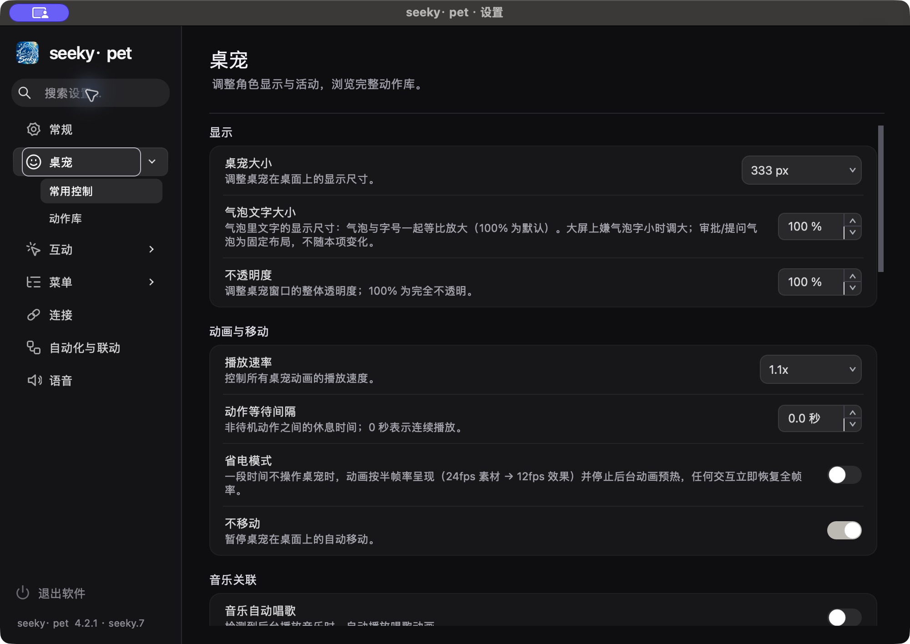
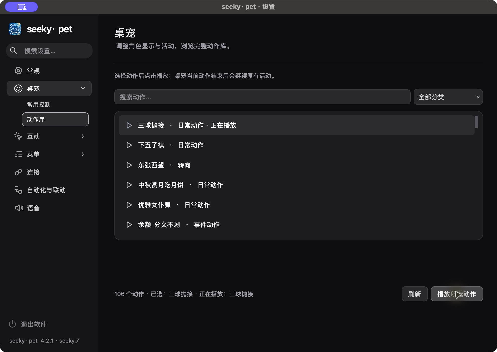

# seeky.7：紧凑设置、交互动效与手动贴顶

> 基线 `45cb1fd5365cbfa47a1b3c4cbc1a11b937caff5b`（seeky.6），分支 `codex/seeky-pet`。日期 2026-10-05。
> macOS Apple Silicon / 8 GiB / Python 3.13.2 / Qt 6.11.2 / Cocoa / Retina DPR 2。
> 本文在交付完成前持续补入真实结果；未达到的标准单独列出，不以构建成功替代行为验证。

## 1. 实施范围

- 侧栏保留 200 逻辑像素及七域顺序、两级结构、中性黑灰；原品牌图标28px、顶部12px、区域间距6px、一级32px/二级28px、搜索32px。字体增大时按度量增长。
- 桌宠入口采用 Lucide 官方 face-slightly-smiling；原品牌源图及其它功能语义保留，原始SVG和许可证随应用打包。
- 悬停120ms、选中140ms、按压80ms至0.97、图标80ms至1.10后160ms回落；共用底板160ms、内容120ms淡入。绘制变换不改变点击范围。隐藏停止、减少动态直接落到目标值。
- 一级入口选择域内当前页，独立箭头展开/收起；导航与页面复用，键盘焦点和选中状态保留。底部只有退出软件；X/Esc保存关闭，保存或应用失败保持窗口。
- 动作库沿用上一版已实现的请求/排队/主进程推送状态，真实 IPC 验证重复动作、断线重连、选择和滚动保持；协议及持久配置不增加字段。
- 贴顶控制器逐宠持有手动拖拽资格和已确认贴顶状态。自动运动到顶保持直立；手动阈值后110px预览、40px松手吸附，拖下或自动飞行解除。旋转、边界放宽、吸附偏移统一按资格门控。
- 朝向依据稳定身体中心及实际旋转/虚拟位置/绘制偏移，屏幕左右判断后补偿镜像。身体位置不跟随；120ms轮询、280px半径、16px死区及no_mirror规则保留。

## 2. 实机运行记录与可重复证据

原生 Cocoa 是主要交互证据。实装前的红灯、成功复跑和失败诊断均归档到 [证据目录](evidence/seeky7/)。少量预先建立的隔离边界模拟系统减少动态、保存异常及迟到/失败退出响应，这些无法安全稳定地通过修改用户系统偏好或强制真实服务器故障覆盖；失效模式与预期结果写于对应实现前创建的测试文件。

旧断言中的一级行高34px与本轮明确32px冲突，按新要求更新，字体放大仍单独验收。旧光标路径会先临时还原并运行原生红灯，再恢复最终实现运行绿灯。该比较保留真实指针与截图，检查最终画面方向，不只看内部字段。

### 当前已记录结果

- 设置专项22项通过；最终原生七项流程8项通过；静置30.206秒，动画0、CPU2.2863秒（前一轮0.0352秒，负载不同）。
- 原生尺寸/字体/动作IPC矩阵首轮退出0，包括720×500、1000×680、1100×760及125%字体、搜索、播放、同名排队、断线重连、保存失败恢复；最终矩阵复跑亦退出0，退出文字合成对比度修正至>=4.5:1。
- 手动贴顶及真实指针原生流程31/31通过，左右/实体刘海区悬挂通过；相关运行时回归167项通过。旧侧栏高度断言已按32px修正。原版真实指针22项中12项失败、无脚本错误；修复后实际渲染哈希均符合朝向。
- 项目 pyc 和 README/THIRD_PARTY_NOTICES.md 存在 iCloud dataless 条目，直接读取会阻塞。专项运行改用独立 PYTHONPYCACHEPREFIX，未改变系统同步设置或删除占位文件；原始失败日志保留。

## 3. 性能分析与画质

基线采用冻结 HEAD 的独立代码副本，原素材只读共享，balanced预热、公开三宠、100秒/35秒后窗口、种子42。三轮分别为同高清素材、不同动作混合尺寸、不同动作混合尺寸加缩放/关闭重生。测试未主动退出原用户应用；系统压力逐秒记录。后续检查发现原主进程98986已不在、设置进程99028仍在，原因未核验。原生测试命令端点按各自临时配置路径隔离；机器应用状态和负载均有变化，因此不能将前后差值归因于本轮代码。

| 轮次 | 基线三宠fps | 源帧前向缺口 |
|---|---|---:|
| 1 | 8.32 / 8.31 / 8.24 | 0 |
| 2 | 21.82 / 21.82 / 10.60 | 0 |
| 3 | 15.01 / 18.94 / 12.41 | 0 |

基线第一轮系统CPU中位数99.9%，最低可用内存约0.968GiB。前后数据受机器负载影响，本轮UI/交互修改不直接改变解码算法，不能将偶发占用或fps差异归因于本轮改动。最终三轮已完成，只有不同动作混合尺寸轮通过全部三宠22fps；同HQ与缩放/关闭重生轮未达到，缺口均0。620秒长时观察也完成；性能验收仍有未通过项。

215个受保护输入覆盖106原始WebM、106HQ WebM、质量索引和两张品牌源图。源码构建后逐文件SHA-256与基线完全一致；包内素材亦逐文件核验。源RGBA及最终覆盖/绘制另有实际Qt检查。

## 4. 交付

目标 UI版本4.2.1 · seeky.7、CFBundleVersion4.2.1.7；上游基础版本4.2.1保持。安装前保存用户设置，退出旧进程，完整保留旧应用回退副本；签名核验后APFS克隆暂存并原子替换。旧设置99028通过原生保存关闭；安装guard又发现旧主进程45905仍运行（启动原因未核验），未覆盖运行中的应用，经现有quit IPC应答后正常退出。新包已克隆安装，Config字节未变；版本4.2.1.7、完整旧包二进制SHA相同备份均核验。安装后的静态核验及真实IPC均退出0；原生CUA实际窗口确认底部4.2.1 · seeky.7、表情头像、200px紧凑侧栏、键盘导航和106动作。点击播放后先见已排队，再由主进程更新为正在播放；截图与AX记录已保存。Git交付记录随后补齐。

画质补充：实际AppShell中1280→2560→1280源切换、动作时长保持10.04秒、高清播放23.7817fps、缺口0、旧HQ队列清零。三种输入的24帧RGBA管线哈希相同，9种缩放/旋转覆盖区域与显示字节一致，均退出0。

### 三轮最终数据（物理占用与RSS分开）

| 轮次 | 基线fps | seeky.7 fps | 基线/当前物理峰值MiB | 基线/当前固定窗口物理中位数MiB | 基线/当前RSS中位数MiB |
|---|---|---|---|---|---|
| 同HQ三宠 | 8.32/8.31/8.24 | 17.95/17.90/17.88 | 2042.4/1964.3 | 1628.5/1154.7 | 680.4/935.9 |
| 不同动作混合尺寸 | 21.82/21.82/10.60 | 23.49/23.49/22.04 | 1439.2/1355.8 | 954.8/914.9 | 572.6/938.4 |
| 缩放与关闭重生 | 15.01/18.94/12.41 | 17.69/17.68/17.69 | 1713.9/1731.0 | 1305.2/1546.0 | 711.3/933.5 |

所有六轮源帧缺口/队列丢帧0、退出后FFmpeg残留0；第三轮两侧均验证窗口3→2→3。物理峰值没有每轮下降，RSS三轮都更高；本轮未改解码算法，系统负载、换页及原应用状态改变，不能声称内存或fps收益来自本轮UI/行为修改。固定成本窗口为37–99秒，含关闭重生轮为37–85秒，避免将故意关闭窗口后的低占用当作稳态收益。

`.venv`实际就是基线运行环境目录的符号链接，Python、Qt、Pillow、psutil及FFmpeg二进制路径完全相同；[环境核对](evidence/seeky7/performance/runtime-equivalence-2.json)与逐秒系统压力记录可复查。

### 620秒观察与实际成本

长时混合动作/尺寸、缩放与关闭重生：fps14.755/14.737/14.715，源帧缺口0、队列丢帧0，结束无FFmpeg残留；物理峰值2092.15MiB，固定窗口物理中位数1593.29MiB、RSS962.13MiB。系统CPU中位数91.2%，最低可用内存约1.007GiB。

排除早期缩放/预热和末尾主动关闭重生后，100–600秒线性趋势为物理占用+2.039MiB/分钟、RSS−5.007MiB/分钟；首末一分钟物理中位数1582.48→1598.00MiB，RSS988.72→949.42MiB。因此不能声称“完全无增长”，也不能仅凭这一小幅波动判断长期泄漏。

| 长时固定窗口成本分类 | 中位数MiB |
|---|---:|
| FFmpeg实际物理占用 | 1136.53 |
| 主进程实际物理占用 | 459.69 |
| 首帧QImage唯一存储 | 24.61 |
| 播放器队列引用 | 14.06 |
| 共享环引用（本轮不同动作无共享订阅） | 0.00 |
| 队列/环按bytes身份去重后 | 14.06 |
| 播放器显示图像 | 42.19 |
| 窗口缩放图像 | 17.82 |

引用分类不能相加冒充实际物理占用，进程物理中位数与分类独立中位数也不能直接相加。[原始逐帧、逐秒占用、组件及断言](evidence/seeky7/performance/long-after.json)，[统一汇总及固定窗口定义](evidence/seeky7/performance/summary.json)。

## 5. 修改文件说明

| 文件 | 增/删行 | 改动与依据 |
|---|---|---|
| `THIRD_PARTY_NOTICES` | +2 / −1 | 追加官方表情头像来源，保留完整许可。 |
| `docs/INDEX.md` | +1 / −0 | 登记本轮报告。 |
| `pet/branding.py` | +1 / −1 | 显示seeky.7。 |
| `pet/context_menus/icons.py` | +1 / −1 | 现有矢量provider新增表情头像键。 |
| `pet/interaction.py` | +5 / −1 | 屏幕水平差及旋转后的镜像补偿。 |
| `pet/modern_settings_dialog.py` | +24 / −24 | 32px导航、紧凑间距、一枚退出按钮及X/Esc失败留窗。 |
| `pet/settings_brand.py` | +181 / −38 | 复用导航、独立展开箭头、共享底板、页面过渡与统一保存/退出失败处理。 |
| `pet/settings_navigation.py` | +195 / −47 | 绘制反馈、图标回弹、按压缩放、焦点来源和字体度量。 |
| `pet/settings_theme_qss.py` | +9 / −14 | 共享底板透明层、中性反馈、底部重试错误。 |
| `pet/top_flip.py` | +55 / −13 | 逐宠临时手动资格和松手确认，统一清理姿态与偏移。 |
| `pet/ui_motion.py` | +36 / −0 | 可从当前值重定向的有限矩形过渡；沿用减少动态读取。 |
| `pet/window.py` | +7 / −2 | 公开拖拽释放、抛掷、碰撞、取消接入控制器。 |
| `pet/window_optional_services.py` | +32 / −5 | 身体中心与绘制旋转一致的鼠标判断，动作生命周期清理。 |
| `pet/window_placement.py` | +6 / −2 | 以相同资格控制扩大边界、吸附偏移及自动运动解除。 |
| `scripts/build_macos.sh` | +1 / −1 | bundle版本4.2.1.7。 |
| `scripts/verify_dsr_package.py` | +6 / −3 | 验证新版本及interaction字节码实际入包。 |
| `scripts/verify_seeky_ceiling.py` | +16 / −8 | 保留既有回归并按新合同更新断言；原生公开流程与失败证据。 |
| `scripts/verify_seeky_cursor.py` | +4 / −3 | 保留既有回归并按新合同更新断言；原生公开流程与失败证据。 |
| `scripts/verify_seeky_settings_ui.py` | +7 / −5 | 保留既有回归并按新合同更新断言；原生公开流程与失败证据。 |
| `tests/test_desktop_pet_features.py` | +1 / −1 | 保留既有回归并按新合同更新断言；原生公开流程与失败证据。 |
| `tests/test_dsr_codex_and_ceiling.py` | +4 / −2 | 保留既有回归并按新合同更新断言；原生公开流程与失败证据。 |
| `pet/resources/settings-icons/face-slightly-smiling.svg` | +16 / −0 | 官方SVG及完整许可随包，18px矢量绘制。 |
| `scripts/verify_seeky7_interactions.py` | +421 / −0 | 保留既有回归并按新合同更新断言；原生公开流程与失败证据。 |
| `scripts/verify_seeky7_settings.py` | +247 / −0 | 保留既有回归并按新合同更新断言；原生公开流程与失败证据。 |
| `tests/test_seeky7_interactions.py` | +21 / −0 | 保留既有回归并按新合同更新断言；原生公开流程与失败证据。 |
| `tests/test_seeky7_settings.py` | +204 / −0 | 保留既有回归并按新合同更新断言；原生公开流程与失败证据。 |

报告、索引及逐次命令/环境/输入/断言/退出码/PNG归档属于交付证据；完整文件列表与逐文件哈希在交付manifest补入。动作库请求实现、解码、素材、配置格式与IPC本轮沿用既有代码，新增原生验收。

## 6. 测试与验证

首轮全量2964通过、21跳过，唯一失败为本报告缺少三个规定章节；已补齐并保留首轮原始日志。项目规定Ruff及scripts附加检查通过；额外全目录扫描发现4条旧seeky.6归档脚本未使用导入，归档原记录保持，未改检测规则或项目代码。最终全量复跑2965通过、21跳过、261条既有弃用警告，200.73秒，退出0；松手偏移修复后全量再跑2965通过、21跳过、261条警告、226.42秒、退出0；满载三轮各179项通过（51.066/51.139/50.434秒，系统CPU中位数100%），测试制造的负载进程均已清理。首次构建、代码/素材/许可/arm64签名静态检查、真实包106动作列表/播放/错误/退出/子进程清理均退出0。补充物理拖拽验收发现松手后4px预览偏移，修复后再次全量、满载与打包，最终满载三轮各179通过（58.419/61.879/59.637秒），所有负载进程退出，最终包构建/静态/原生IPC均退出0。最终记录在相同路径；此前成功记录保留于 `*-before-release-offset-fix` 目录。

## 7. 已知限制与回滚

三宠22fps目标未全部通过，长时物理占用有小幅上升；不能声称本轮带来解码或内存收益。当前只有一台macOS/Retina实际显示器，多显示器跨屏仅由现有几何/生命周期回归支持，双物理显示器现场未核验。减少动态原生偏好为关，开启时行为通过实现前建立的隔离偏好边界检查，未改用户系统偏好。

没有新增持久配置键；撤销代码提交不需要配置迁移。安装保留完整旧应用回退副本，退出新进程后可按交付记录将原应用恢复原路径。

### 补充公开生命周期场景

补查使用原生AppShell、真实WebM、公开spawn/鼠标事件/save_position/关闭路径，开启物理拖拽并将保存位置在全新进程恢复。最初两次错误断言预览角度应等于180°，实际173.4545°符合110px预览公式；修正为松手后断言后，第三次证实实际落位比完整悬挂偏移少4px。所有失败及当时状态保留，随后仅修正确认贴顶的完整落位同步，不更改预览带或吸附区。修复后两种拖拽的原生矩阵33/33通过，完整偏移精确一致（增强场景修复前相差26px）；额外公开生命周期（物理拖拽、两宠隔离、关闭子宠、保存和新进程恢复）均退出0。刘海/左右三点悬挂复验退出0，相关167项测试通过。位置在确认时经已有统一落位出口同步，之后才保存；没有新增动画循环或线程。性能记录的流程未执行手动吸顶释放，故该有限释放更新不改变此前性能场景，但原生、完整回归、满载与包内代码仍重验。

安装路径 `/Users/ray/Applications/seeky· pet.app`；回退原包 `/Users/ray/Library/Caches/seeky-pet-backups/seeky.6-before-seeky7-20261005-123521.app`。首次安装guard失败及正常quit应答见证据；未强制终止旧软件。

### 安装包与原生界面

安装包 `/Users/ray/Downloads/seeky-pet-4.2.1.7-macOS-arm64.zip`，1553295997字节，2247条目CRC全部有效，SHA-256 `a2038e745df3cdb969d46100af72efd78e4ab598ec0e3e1771b2d92963f1e562`。macOS ditto的UTF8文件名元数据需在Python验证器显式设置metadata_encoding；初次验证的读名错误及修正后的真实CRC/版本结果均保留。

[完整安装UI接受记录](evidence/seeky7/installed-ui-acceptance.json)、[安装包核验](evidence/seeky7/package/archive.json)、[可重复命令与重置说明](evidence/seeky7/README.md)。最终真实主进程与设置窗口保留打开。CUA按bundle只选一个PID，临时经正常IPC退出自启测试主进程以绑定独立设置，再恢复主进程；没有强制结束程序或改变偏好。
